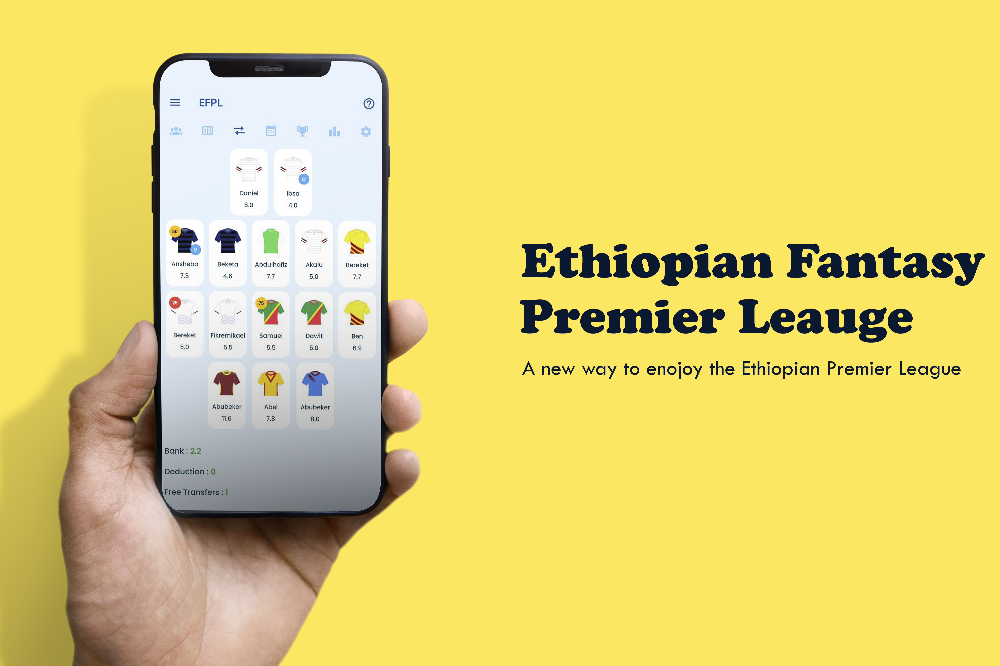
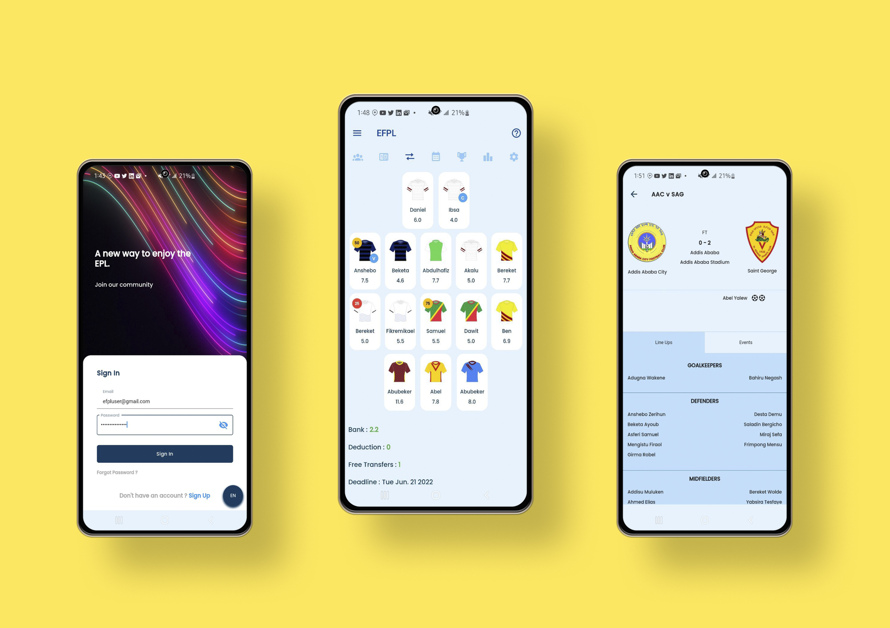

# EFPL User Client




<br>

## Flutter Version
Flutter **2.10.2** • channel stable • https://github.com/flutter/flutter.git

Framework • revision 097d3313d8 (2 weeks ago) • 2022-02-18 19:33:08 -0600

Engine • revision a83ed0e5e3

Tools • Dart 2.16.1 • DevTools 2.9.2

<br>

## File Structure
- __infrastructure/__ - Repositiory and data sources
- __domain/__ - Value objects and failures
- __application/__ - BLoC logic
- __presentation/__ - UI elements
- __services/__ - Helper functions
- __locales/__ - Localization files

<br>

## Configuration Files
- __analysis_options.yaml__: Dart analyzer liniting settings
    - Trailing commas 

<br>

## Project setup
### Add .env file

```
API=YOUR_EXPRESS_SERVER_ADDRESS:PORT
```